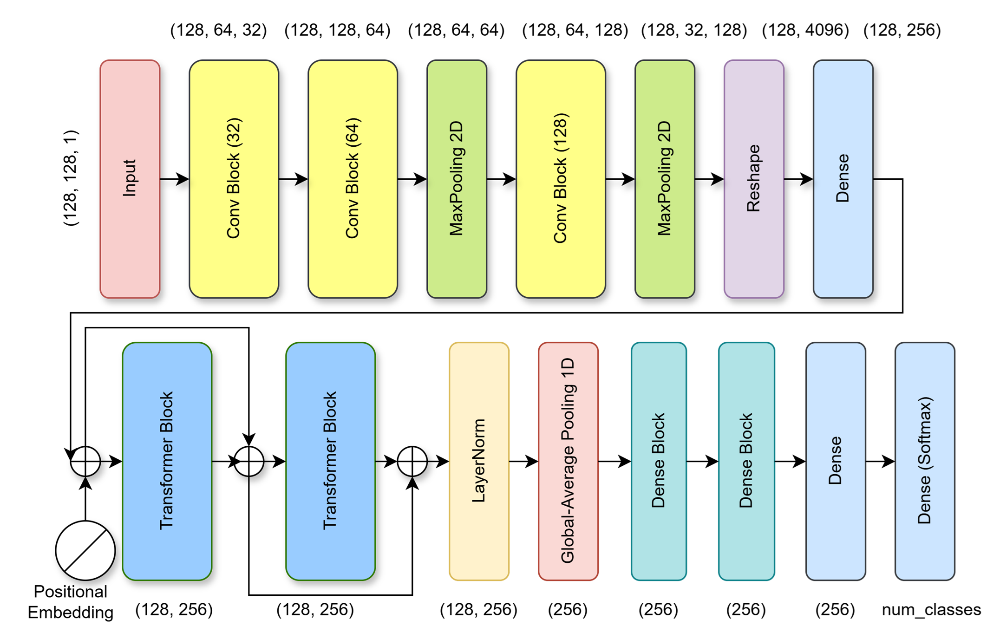
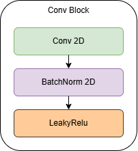
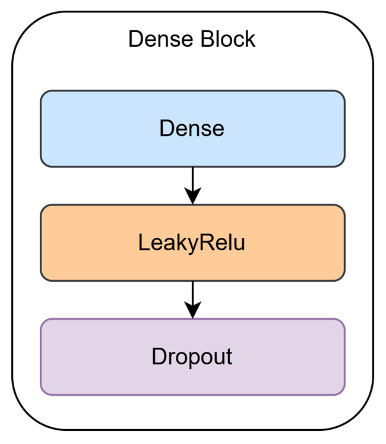

# Environmental Sound Classification (ESC)

This repository contains a deep learning model for classifying environmental sounds, built using Keras with the JAX backend. The model is designed to process audio files using a combination of Convolutional Neural Networks (CNNs) and Transformer blocks, to capture both local frequency shifts and global temporal context from Mel Spectrogram representations.

## Overview

The notebook `ESC_New.ipynb` outlines the entire workflow:

1. **Data Loading and Augmentation:** Uses the `audiomentations` library to apply data augmentations like Gaussian Noise, Time Stretching, Pitch Shifting, and Time Masking.
2. **Feature Extraction:** Audio files are converted into Mel Spectrograms that represent the sound over time, giving the model a rich representation of audio frequencies.
3. **Model Architecture:** A robust hybrid CNN-Transformer architecture is used for extracting classification embeddings.
4. **Training and Evaluation:** The model is trained on both the UrbanSound8K dataset and the ESC-50 dataset.

## Deep Learning Architecture

The proposed network implements a hybrid approach, using a CNN frontend to process the temporal and spectral aspects of the audio, and a Transformer backend to contextualize the sequence tokens.

### Main Architecture



_An overview of the CNN-Transformer Architecture._

1. **CNN Frontend:**
   The initial layers consist of 2D Convolution layers combined with Batch Normalization, LeakyReLU activations, and MaxPooling. This segment extracts local spectral and temporal features before sequence tokenization.

   

2. **Sequence Tokenization & Positional Embedding:**
   After the CNN layers extract feature maps, the outputs are reshaped and a positional embedding is added to track structural order within the sequence.

3. **Transformer Backend:**
   The reshaped feature sequence passes through a series of Multi-Head Attention blocks and Feed Forward Neural Networks (with Layer Normalization and Dropout). This captures the long-range temporal dependencies and global context within the audio clip.

4. **Classification Head:**
   The output from the transformer blocks is pooled using 1D Global Average Pooling, passed through dense layers, and terminates in a Softmax output representing our multiple sound classes.
   

## Dependencies

You can install the primary dependencies as follows:

```bash
pip install numpy pandas librosa scikit-learn matplotlib tqdm seaborn
pip install audiomentations
pip install keras jax jaxlib
```

## Datasets

The architecture has been experimented on and utilizes:

- **UrbanSound8K**: Contains 8732 labeled sound excerpts of urban sounds from 10 classes.
- **ESC-50**: Dataset for Environmental Sound Classification consisting of 2000 environmental audio recordings.

## Model Training

The notebook leverages `keras.optimizers.AdamW` with custom learning rates and achieves high validation accuracy. Once training completes, the model weights/architecture are saved as `us8k_train.keras`.
